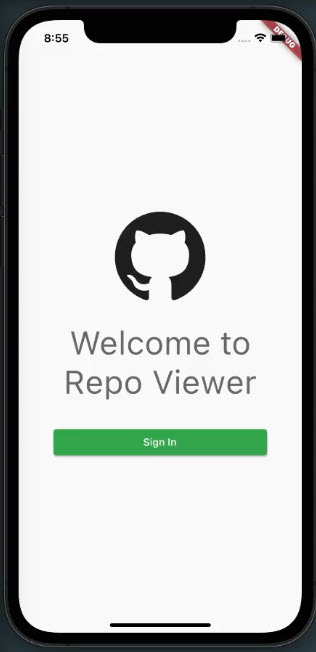
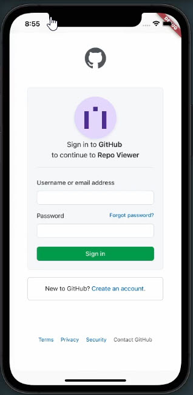

https://docs.github.com/en/rest/reference/activity#list-repositories-starred-by-the-authenticated-user

https://docs.github.com/en/rest/reference/search#search-repositories

https://docs.github.com/en/rest/overview/media-types

https://docs.github.com/en/rest/reference/repos#get-a-repository-readme

https://docs.github.com/en/rest/reference/activity#check-if-a-repository-is-starred-by-the-authenticated-user

How to Start

Step 1:

Download or clone this repo

Step 2:

Go to project root and execute the following command in console to get the required dependencies:

flutter pub get

Step 3:

This project uses libraries that works with code generation, execute the following command to generate files:

flutter packages pub run build_runner build --delete-conflicting-outputs

or watch command in order to keep the source code synced automatically:

flutter packages pub run build_runner watch

Step 4:

Create an Github OAuth App on Github Settings|Developer settings|OAuth Apps with http://localhost:8080 as Homepage URL

Save the CLIENT_ID and CLIENT_SECRET in a .env file (see .env.sample file as example)
Code Snippets
Upgrade pubspec.yaml

make upgrade

Build iOS

make build_ios_mobile

Build and watch automatic code generation

flutter pub run build_runner watch --delete-conflicting-outputs
